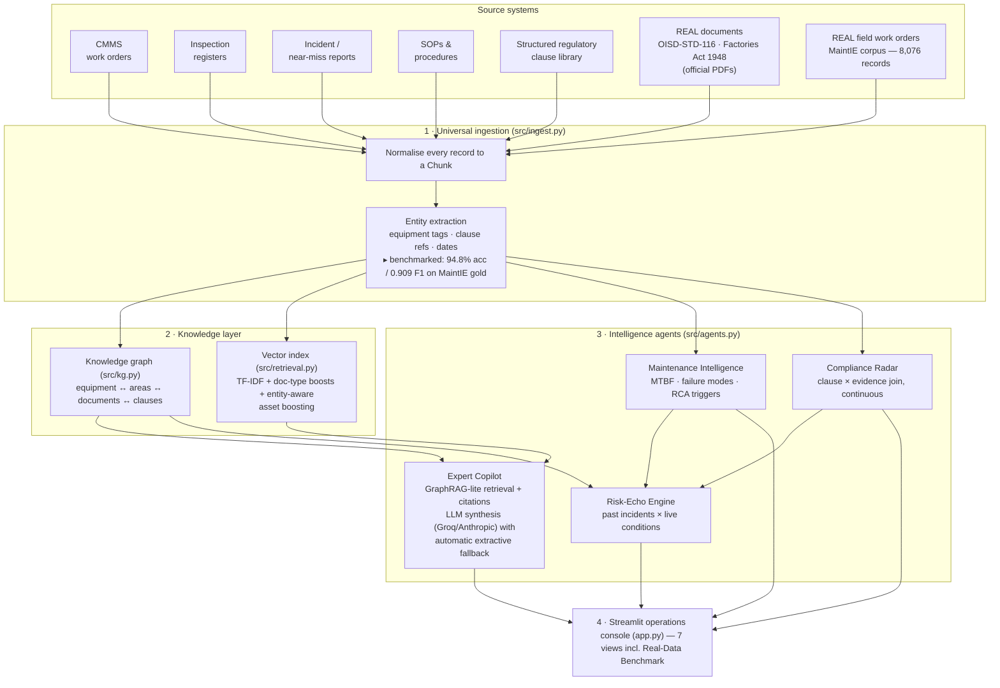

# PlantBrain — Architecture

## System overview

## Design decisions

**One chunk schema for everything.** A CMMS row, a real MaintIE field work order, a page of the
official OISD-STD-116 standard, and a section of an incident report all become the same `Chunk`
with extracted entities. Downstream agents never care where a fact came from.

**Measured, not asserted.** The entity-extraction layer is scored against 1,076 expert
double-annotated real work orders (MaintIE, LREC-COLING 2024): 94.8% token accuracy, 0.909
macro-F1 on a held-out split. The classifier is deliberately simple (windowed lexical features →
logistic regression) so the number is reproducible live; production swaps in a fine-tuned
transformer.

**GraphRAG-lite retrieval** (after Document GraphRAG, Electronics 2025; FDRKG-LLM, IJPR 2025).
Vector hits are expanded with 1-hop knowledge-graph neighbours of the assets they mention, so
structurally related documents surface even with zero term overlap — the C-201 failure query
pulls in the vibration SOP and OISD-RP-124 through the graph. Graph-sourced citations are
badged distinctly in the UI.

**Full-document context for narrative sources.** Retrieval matches sections, but the LLM
receives the complete incident report or SOP a matched section belongs to — a summary section
alone can miss the root cause two headings below it.

**Entity-aware ranking.** A query naming a specific asset (C-201) multiplies that asset's
records ×1.6 — plant-specific questions prefer plant records over look-alike field text.

**Compliance is a join, not a report.** The Compliance Radar continuously joins the clause
library (applicability × frequency × required evidence) against the inspection register.

**Risk echoes = incidents × live conditions.** Every historical incident's assets are checked
against currently active signals (overdue statutory evidence, repeat-failure patterns). This
turns the incident archive into a prevention system.

**Graceful LLM degradation.** With a `GROQ_API_KEY` (or `ANTHROPIC_API_KEY`), answers are
synthesized by an LLM constrained to retrieved context; any API failure silently falls back to
extractive mode. The demo cannot be killed by connectivity.

## Production path

| Prototype | Production |
|---|---|
| TF-IDF + boosts | Embedding model + vector DB, hybrid BM25+dense |
| NetworkX in-memory graph | Neo4j with industrial ontology (ISO 14224) |
| Logistic-regression NER (benchmarked) | Fine-tuned transformer NER on MaintIE schema |
| Groq/Anthropic single call | Multi-agent orchestration, per-plant model routing |
| PDF page chunks | Layout-aware parsing + P&ID computer vision (cf. Digitize-PID, TCS) |
| CSV/Markdown connectors | SAP PM / Maximo connectors, OCR pipeline, email archives |
| Streamlit | Role-based web + mobile for field technicians |
